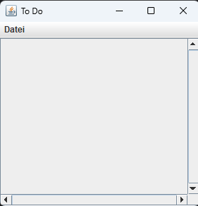
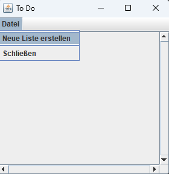
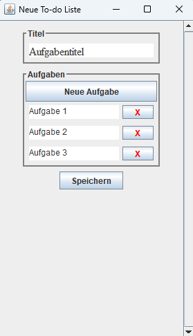
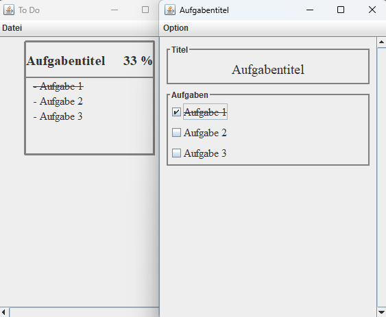
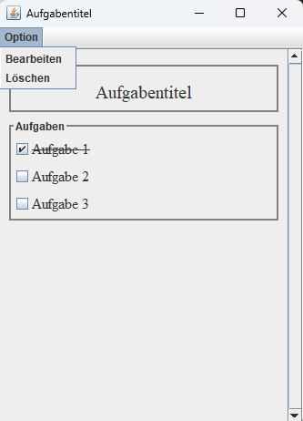
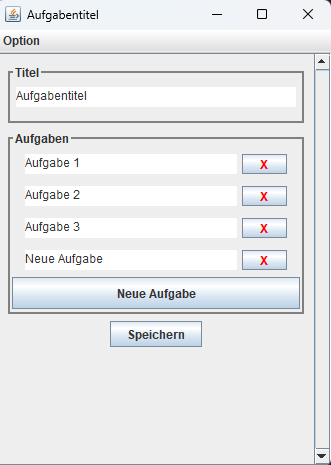

# To-do-Liste

## Inhaltsverzeichnis
- [Beschreibung](#beschreibung)
- [Verwendung](#verwendung)
- [Anleitung](#anleitung)
- [Autor](#autor)
- [Lizenz](#lizenz)

## Beschreibung
Mit dieser Anwendung ist es möglich To-do-Listen zu erstellen, zu bearbeiten und zu löschen.

## Verwendung
Durch das Ausführen der To-Do-Liste.exe Datei ist es möglich bereits erstellte Listen anzusehen. In der Menüleiste
gibt es die Möglichkeit eine neue Liste zu erstellen. Wenn eine Liste im Hauptfenster ausgewählt
wurde, dann kann man in der Menüleiste die Liste bearbeiten oder löschen.

## Anleitung
Die To-do-Liste.exe Datei ausführen und es erscheint ein neues Fenster, das zu Anfang leer ist, weil
es noch keine Listen gibt.

In der Menüleiste ist es möglich eine neue Liste zu erstellen.

Nachdem ein Fenster erschienen ist, kann man einen Titel bestimmen und Aufgaben hinzufügen.

Wenn die Liste gespeichert wurde, dann taucht die Liste in dem Hauptfenster auf. Durch Anklicken
der Liste öffnet sich ein neues Fenster, indem die Aufgaben abgehackt werden können.

In der Menüleiste ist es möglich die Liste zu bearbeiten oder ggf zu löschen.

Wenn die Liste bearbeitet wird kann der Titel geändert werden, einzelne Aufgaben gelöscht oder 
geändert werden und es können neue Aufgaben hinzugefügt werden.

## Autor

## Lizenz
[MIT](https://choosealicense.com/licenses/mit/)